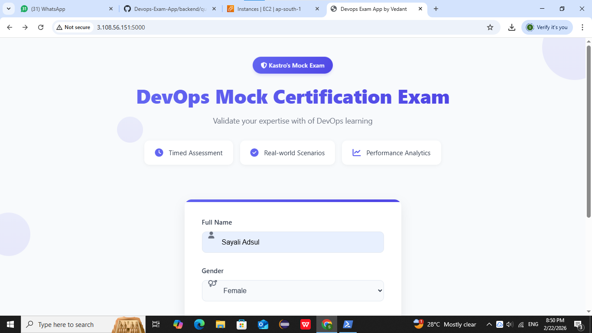
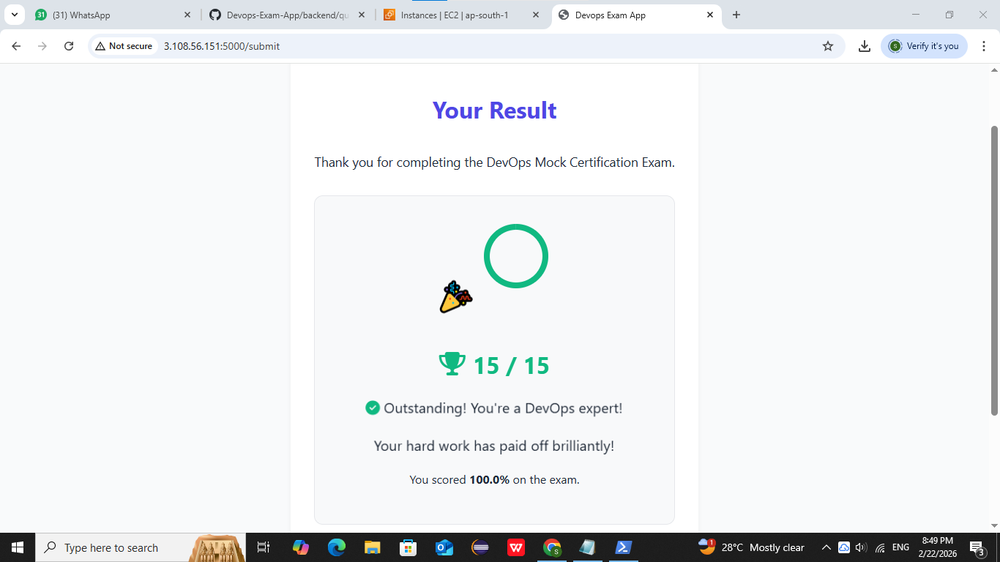
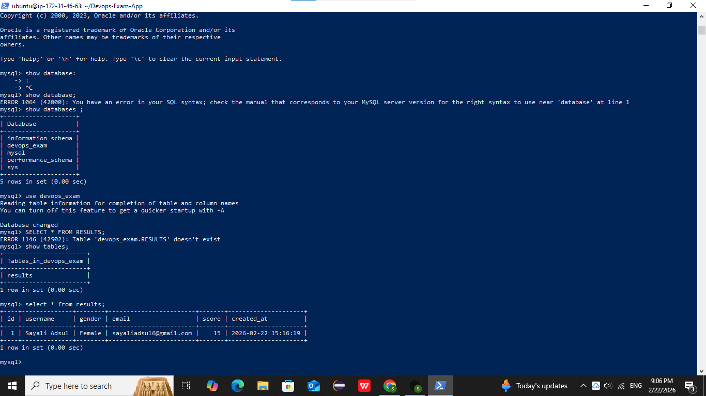

# 📘 DevOps Exam App – Dockerized Full Stack Project

A Dockerized Full Stack DevOps Exam App built using:

- 🐍 **Flask (Backend)**
- 🖥 **HTML + JavaScript (Frontend)**
- 🐬 **MySQL 5.7 (Database)**
- 🐳 **Docker + Docker Compose**
  
## 🚀 My Contribution (Deployment & DevOps Implementation)

This project is based on the original open-source repository by Vedant Tambe.  
My primary focus was on deployment and DevOps implementation.

### 🔧 What I Implemented:

- Cloned and configured the open-source application
- Deployed the application on **AWS EC2 (Ubuntu Linux)**
- Installed and configured Docker & Docker Compose
- Managed multi-container setup (Flask + MySQL)
- Configured environment variables for service communication
- Configured AWS Security Groups to allow HTTP access
- Verified container networking and application accessibility
- Monitored and troubleshot logs using Docker CLI

This project helped me gain hands-on experience in containerization, Linux server management, and cloud deployment.

---

# 🚀 Setup Instructions

# ✅ 1. Install Docker and Docker Compose

```bash
sudo apt update
sudo apt install -y docker.io docker-compose
````

Enable and start Docker:

```bash
sudo systemctl enable docker
sudo systemctl start docker
```

Verify installation:

```bash
docker --version
docker-compose --version
```

---

# 📥 2. Clone the Repository

```bash
git clone https://github.com/VedTambe/Devops-Exam-App.git
cd Devops-Exam-App
```

---

# 🔐 3. Create `.env` File

Create a file named `.env` at the root of the project and add:

```env
PORT=5000
DB_HOST=exam-mysql
DB_USER=exam_user
DB_PASSWORD=exam_pass
DB_NAME=devops_exam
```

---

# 🐬 4. MySQL Auto Setup

The file `db/init.sql` will:

* Create a database `devops_exam`
* Create a table `results`
* Create user `exam_user` with password `exam_pass`
* Grant all privileges

⚠️ No need to do this manually — handled by Docker Compose.

---

# 🐳 5. Build & Run the App

```bash
docker-compose up --build
```

This will:

* Start MySQL container on port 3306
* Start Flask app on port 5000
* Load environment variables from `.env`

---

# 🌐 6. Access the Application

Open browser and visit:

```
http://<your-ec2-public-ip>:5000/
```

---

# 🧪 7. Optional: Access MySQL

```bash
docker exec -it mysql_db /bin/bash
mysql -u root -p
```

Then run:

```sql
SHOW DATABASES;
USE devops_exam;
SHOW TABLES;
SELECT * FROM results;
```

---

# ⛔ 8. Stop the Application

```bash
docker-compose down
```


---

# 💡 Tips

If you update the `init.sql`, run:

```bash
docker volume rm devops-exam-app_db_data
docker-compose up --build
```

---
---

# 📸 Screenshots

### 🖥 Application Running


### 📝 Submit Exam


### 🗄 Database Output


---
---

# ☁️ Deployment

- Deployed on AWS EC2 (Ubuntu Linux)
- Used Docker & Docker Compose
- Configured security group for port 5000
- Managed Linux server setup and Docker installation

---
### 🙌 Credits

Original project developed by **Vedant Tambe**  
Deployment and DevOps implementation by **Sayali Adsul**


